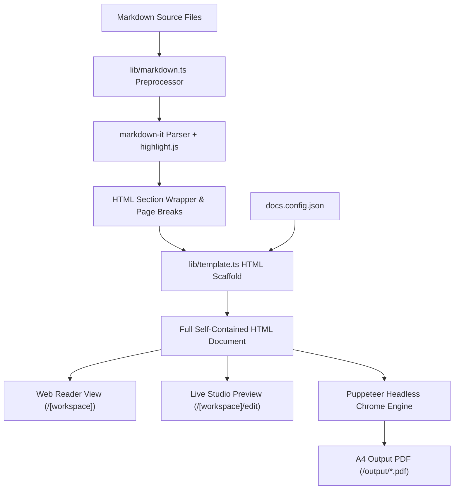

# Architectural Design Specification: tan-docs-engine

**Project:** `tan-docs-engine`  
**System Type:** Multi-Tenant Technical Documentation Engine & Web Authoring Studio  
**Primary Tech Stack:** Next.js 15 (App Router), React 19, TypeScript, Tailwind CSS, TipTap 3, Markdown-it, Puppeteer, Zustand  

---

## 1. System Overview & Core Objectives

`tan-docs-engine` คือระบบสร้างและจัดการเอกสารสเปกทางเทคนิคระดับองค์กร (Enterprise Technical Specifications & Requirement Confirmation Documents) แบบ Multi-Tenant รวมศูนย์ รองรับการจัดทำเอกสารทั้งภาษาไทยและภาษาอังกฤษ พร้อมระบบ Export เป็น A4 PDF คุณภาพสูง (High-Fidelity Printable PDF)

### Core Objectives
1. **Multi-Tenant Workspace Isolation:** จัดการเอกสารแต่ละชุดแยกอิสระในโฟลเดอร์ `workspaces/<slug>` โดยมี `docs.config.json` เป็น Single Source of Truth
2. **Dual-Mode Authoring Studio:** เครื่องมือเขียนเอกสารบนเว็บที่สลับไปมาระหว่าง **Visual WYSIWYG** (สำหรับ Business/Product Owner) และ **Raw Markdown** (สำหรับ Developer/Architect) ได้แบบไร้รอยต่อ โดยไม่สูญเสียข้อมูล
3. **Deterministic PDF Engine:** ระบบคอมไพล์เอกสารผ่าน Headless Chromium (Puppeteer) ควบคุมระยะขอบ เลย์เอาต์ A4, หน้าปก (Cover Page), หัวกระดาษ/ท้ายกระดาษ (Header/Footer), เลขหน้าอัตโนมัติ และแผนภาพ Mermaid อย่างแม่นยำ
4. **Instant Asset Management:** อัปโหลดและแทรกรูปภาพด้วยการ Copy/Paste (`Cmd+V`) หรือ Drag & Drop ลงใน Editor โดยบันทึกไฟล์เข้า asset directory ของ workspace อัตโนมัติ

---

## 2. System Architecture & Tech Stack

```
                                  +--------------------------------------------------+
                                  |              tan-docs-engine Architecture        |
                                  +--------------------------------------------------+
                                                            |
                 +------------------------------------------+------------------------------------------+
                 |                                                                                     |
                 v                                                                                     v
     [ Web Interface & Studio ]                                                             [ Document Engine Core ]
  +-------------------------------+                                                      +-------------------------------+
  | - Next.js 15 App Router       |                                                      | - Markdown Parser (markdown-it)|
  | - Reader View (/[slug])       |                                                      | - Syntax Highlight (highlight)|
  | - Studio View (/[slug]/edit)  |                                                      | - Mermaid Block Extractor     |
  | - Print View (/[slug]/print)  |                                                      | - Gojo Enrich Preprocessor    |
  | - Dual-Mode Editor (TipTap)   |                                                      | - HTML Template Combiner      |
  | - Zustand State Store         |                                                      | - Puppeteer PDF Exporter      |
  +-------------------------------+                                                      +-------------------------------+
                 |                                                                                     |
                 +------------------------------------------+------------------------------------------+
                                                            |
                                                            v
                                            +-------------------------------+
                                            |       Filesystem Storage      |
                                            |    /workspaces/<slug>/...     |
                                            |   - docs.config.json          |
                                            |   - src/*.md                  |
                                            |   - src/assets/*              |
                                            +-------------------------------+
```

### Component Stack
| Layer | Technologies | Responsibilities |
| :--- | :--- | :--- |
| **Framework & UI** | Next.js 15, React 19, Tailwind CSS | App Router, SSR/CSR, Responsive Document UI |
| **Rich-Text Engine** | `@tiptap/react`, `tiptap-markdown` | Visual WYSIWYG document editing, formatted tables, marks |
| **Markdown Processing** | `markdown-it`, `highlight.js`, `task-lists` | Markdown parse, code block highlight, task checkboxes, Thai preprocessing |
| **Diagram Engine** | `mermaid.js` | Client-side reactive diagram rendering, error boundary handling |
| **PDF Generation** | `puppeteer` | Headless Chrome print generation, print-to-PDF, A4 page layouts |
| **State Management** | `zustand` | Studio active tab, unsaved dirty state, outline search, view toggles |

---

## 3. Multi-Tenant Workspace Model

เอกสารทุกชุดจัดเก็บอยู่ใน `/workspaces/<slug>` ซึ่งถูกตัดขาดจากกัน (Tenant Isolation) ตามโครงสร้างดังนี้:

```
workspaces/
├── <workspace-slug>/
│   ├── docs.config.json       # Workspace metadata, ordering, and theme
│   └── src/
│       ├── 01-system-overview.md
│       ├── 02-architecture.md
│       ├── 03-api-specs.md
│       └── assets/            # Uploaded images, diagrams, attachments
```

### `docs.config.json` Schema
```json
{
  "name": "wallet-project",
  "title": "Wallet Platform Specification",
  "subtitle": "Technical Architecture & Integration Manual",
  "documentNumber": "DOC-WLT-001",
  "version": "1.0.0",
  "status": "Approved",
  "author": "Architecture Team",
  "client": "Financial Corp",
  "organization": "TAN TECHNOLOGY SOLUTIONS",
  "date": "2026-09-23",
  "description": "Core wallet specification",
  "coverPage": true,
  "files": [
    "01-system-overview.md",
    "02-technical-architecture.md",
    "03-database-schema.md"
  ],
  "theme": {
    "primaryColor": "#0f172a",
    "accentColor": "#2563eb",
    "logoUrl": ""
  },
  "pdfOptions": {
    "format": "A4",
    "orientation": "portrait",
    "printBackground": true,
    "displayHeaderFooter": true
  }
}
```

### File Resolution & Section Chaining
1. **Ordered Compilation:** หาก `files` มีการระบุใน `docs.config.json` ไฟล์จะถูกคอมไพล์ตามลำดับที่กำหนด หากไม่มี จะทำการอ่านไฟล์ `.md` ใน `src/` ทั้งหมดและเรียงลำดับแบบ alphanumeric sorting
2. **Page Break Insertion:** ระหว่างไฟล์แต่ละส่วน (`section`) ระบบจะแทรก `<div class="page-break"></div>` โดยอัตโนมัติเพื่อให้แต่ละโมดูลเริ่มต้นบนหน้าใหม่เมื่อสั่งพิมพ์/ออก PDF

---

## 4. Document Rendering & PDF Compilation Pipeline



### Pipeline Stages
1. **Pre-processing (`preprocessRequirementDoc`):**
   - แปลง Syntax ยอดนิยม เช่น `<!-- pagebreak -->` หรือ `\pagebreak` ให้เป็น `<div class="page-break"></div>`
   - ตรวจจับหัวเรื่องและคำโปรยระดับบนสุด แปลงเป็น Styled Header Banner
   - แปลงตารางประวัติเอกสารและการควบคุมเวอร์ชันแบบ Enterprise Specification
2. **Markdown to HTML Conversion:**
   - ใช้ `markdown-it` พร้อมปลั๊กอิน `markdown-it-task-lists`
   - แปลง Code Block ที่เป็น `mermaid` ให้อยู่ใน Container `<div class="mermaid">` เพื่อให้ Client Renderer หรือ Script จัดการวาดกราฟิก
   - ไฮไลต์ Syntax ด้วย `highlight.js` รองรับภาษา TypeScript, C#, SQL, JSON, YAML, Bash ฯลฯ
3. **Template Assembly (`generateWorkspaceHtml`):**
   - รวม `Cover Page` (หากเปิด `coverPage: true`) ที่มี Metadata, ชื่อเอกสาร, เวอร์ชัน, องค์กร, วันที่, และกรอบลงนาม
   - ผสาน CSS System: Print Stylesheet, Typography (`@tailwindcss/typography`), Table borders, Page number counters
   - ฉีด Theme Variables (`--primary-color`, `--accent-color`) เข้า Root Scope
4. **PDF Generation (`renderWorkspacePdf`):**
   - ใช้ Puppeteer ค้นหา Chrome Executable ภายในเครื่อง (macOS, Linux, Windows)
   - โหลด HTML จำลองหน้ากระดาษแบบ A4 Portrait (Print Background Enabled)
   - รอการเรนเดอร์ Mermaid Diagram จนสมบูรณ์ (`networkidle0` + evaluation wait)
   - ส่งออกเป็นไฟล์ PDF เก็บไว้ที่ `/output/<slug>-<title>-v<version>.pdf`

---

## 5. Web Studio & Dual-Mode Authoring Design

หน้าจอ Studio (`/[workspace]/edit`) ออกแบบสำหรับการเขียนเอกสารอย่างมีประสิทธิภาพ:

### 5.1 Dual-Mode Editor (Visual vs Markdown)
- **Visual Mode (WYSIWYG):** พัฒนาบน TipTap v3 พร้อม extensions สำหรับ Table, TableRow, TableHeader, TableCell, TaskList, TaskItem
  - เหมาะสำหรับ: การจัดตารางสเปก, แก้ไขคำ, จัด Formatting แบบไม่ต้องจำสัญลักษณ์ Markdown
- **Markdown Mode (Raw Syntax):** Monospace Textarea ประสิทธิภาพสูง พร้อม Cursor position (`Ln X, Col Y`), Word/Character counter, Search & Replace overlay
  - เหมาะสำหรับ: การเขียน Mermaid diagram, แทรก Page Break, Paste code snippets
- **Bi-directional Sync:** สถานะเนื้อหาใน Editor ถูกจัดการผ่าน `useStudioStore` การสลับโหมดจะแปลง Markdown เป็น TipTap Document และแปลง TipTap กลับเป็น Markdown โดยคงโครงสร้างเดิมและไม่ทำให้ข้อมูลสูญหาย

### 5.2 Real-time Document Outline & Search
- Auto-extract หัวข้อ H1, H2, H3 จากเนื้อหาแบบสดๆ
- คลิกหัวข้อใน Document Outline เพื่อกระโดดไปยังจุดนั้นทันที
- Search & Replace Overlay รองรับ Match Case, Whole Word, และ Regular Expression พร้อมปุ่ม Replace / Replace All

### 5.3 Live Document Preview
- เรนเดอร์ HTML ฝั่งขวาพร้อม Styling ที่ตรงกับผลลัพธ์พิมพ์จริง 100%
- Mermaid diagrams เรนเดอร์ผ่าน Client-side พร้อม Debounce 300ms และ Error Boundary ป้องกันหน้าจอค้างหาก syntax กราฟิกยังพิมพ์ไม่เสร็จ

### 5.4 Instant Image Upload & Drag-and-Drop
- ดักจับ Event `paste` (ภาพจาก Clipboard) และ `drop` (ลากไฟล์รูปภาพมาวางใน Editor)
- ส่งคำขอ `POST /api/workspaces/[slug]/upload`
- บันทึกไฟล์ไปยัง `workspaces/[slug]/src/assets/<timestamp>-<name>`
- แทรก Markdown `` เข้าตำแหน่งเคอร์เซอร์อัตโนมัติ

---

## 6. Backend API Architecture & Security

Route Handlers ทั้งหมดอยู่ภายใต้ `app/api/...`

### 6.1 Path Traversal Guardrails
- **Slug Verification:** ตรวจสอบด้วย Regex `/^[a-zA-Z0-9_-]+$/`
- **Filename Verification:** ตรวจสอบด้วย Regex `/^[a-zA-Z0-9_-]+\.md$/`
- ห้ามมิให้มีพาธที่มี `..`, `/`, `\` หรืออักขระพิเศษ เพื่อป้องกัน Path Traversal ออกนอก `workspaces/`

### 6.2 REST Endpoints Directory
- `GET /api/workspaces` — ดึงรายชื่อ Workspace ทั้งหมด
- `POST /api/workspaces` — สร้าง Workspace ใหม่จาก Template
- `GET /api/workspaces/[slug]/config` — อ่าน `docs.config.json`
- `PUT /api/workspaces/[slug]/config` — อัปเดต `docs.config.json`
- `GET /api/workspaces/[slug]/files` — ดึงรายชื่อไฟล์และลำดับไฟล์ใน Workspace
- `POST /api/workspaces/[slug]/files` — จัดการไฟล์ (Action: `create`, `rename`, `reorder`, `delete`)
- `GET /api/workspaces/[slug]/files/[filename]` — อ่านเนื้อหา Markdown ในไฟล์
- `PUT /api/workspaces/[slug]/files/[filename]` — บันทึกเนื้อหา Markdown ลงไฟล์
- `POST /api/workspaces/[slug]/upload` — อัปโหลด Asset รูปภาพ
- `GET /api/pdf?workspace=[slug]` — สั่ง Render และ Download PDF ของ Workspace แบบ On-demand

---

## 7. Print & A4 Layout Guidelines

การจัดทำเอกสารเพื่อพิมพ์และแปลงเป็น PDF ต้องสอดคล้องกับมาตรฐาน Paged Media CSS:

```css
@page {
  size: A4 portrait;
  margin: 18mm 16mm 20mm 16mm;
}

@page :first {
  margin: 0; /* Cover page full bleed */
}

.page-break {
  page-break-after: always;
  break-after: page;
}

/* ป้องกันตารางและรูปภาพถูกตัดครึ่งหน้า */
table, pre, .mermaid, blockquote {
  page-break-inside: avoid;
  break-inside: avoid;
}
```

- **Thai Typography:** กำหนด Line Height และ Font Smoothing ให้ตัวอักษรภาษาไทยแสดงผลคมชัด ไม่มีการซ้อนทับของสระและวรรณยุกต์
- **Cover Page Standard:** ออกแบบเป็นหน้าเต็ม (Full Bleed) มีแถบสี Theme Accent ด้านข้าง, รหัสเอกสารมุมบนขวา, และตารางเซ็นอนุมัติที่มุมล่าง
