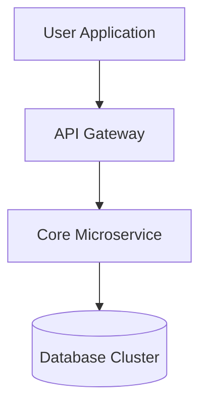

# d Requirement Confirmation & System Specifications

## 1. บทนำและวัตถุประสงค์ (Overview)
ยินดีต้อนรับสู่เอกสารสเปกของ **d**

- **Project:** d
- **Version:** v1.0.0
- **Author:** Tan System Architecture Team

## 2. แผนภาพสถาปัตยกรรม (Architecture Flowchart)

<!-- pagebreak -->

## 3. รายละเอียดระบบ (System Specifications)
| โมดูล (Module) | รายละเอียด (Description) | สถานะ (Status) |
| :--- | :--- | :--- |
| Core Engine | ประมวลผลและจัดการข้อมูลหลัก | กำลังพัฒนา |
| Security & Auth | การยืนยันตัวตนและการเข้าถึง | เสร็จสมบูรณ์ |
