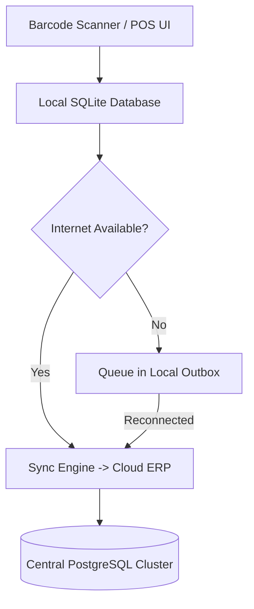

# 1. ภาพรวมระบบ Smart POS Terminal

เอกสารนี้ระบุข้อกำหนดทางเทคนิคและการเชื่อมต่อสำหรับเครื่องจุดขายอัจฉริยะ (Point of Sale) รุ่นใหม่ที่ออกแบบให้ทำงานได้ทั้งโหมด Online และ Offline

## 1.1 วัตถุประสงค์และการทำงานแบบ Offline-First

ระบบถูกออกแบบด้วยสถาปัตยกรรม Local SQLite Cache ร่วมกับ Event Sourcing เมื่อสัญญาณอินเทอร์เน็ตขาดหาย เครื่องยังคงสามารถสแกนบาร์โค้ด คิดเงิน และพิมพ์ใบเสร็จได้อย่างต่อเนื่อง

---

## 1.2 การรองรับอุปกรณ์ต่อพ่วง (Hardware Peripherals)

รายการอุปกรณ์ที่ผ่านการทดสอบและรองรับแบบ Plug & Play:

* [x] **Thermal Receipt Printer**: รองรับพอร์ต USB และ Ethernet (ESC/POS Protocol)
* [x] **2D Barcode Scanner**: รองรับการอ่าน QR Code และ UPC/EAN Barcode จากหน้าจอสมาร์ทโฟน
* [x] **Electronic Cash Drawer**: ควบคุมการเด้งเปิดด้วยพัลส์ RJ11 ผ่านเครื่องพิมพ์
* [ ] **Customer Facing Display (VFD)**: จอแสดงยอดชำระแบบ 2 บรรทัด
* [ ] **EDC Credit Card Terminal**: เชื่อมต่อผ่านโปรโตคอล Serial/USB เพื่อรับยอดอัตโนมัติ

---

## 1.3 ข้อกำหนดประสิทธิภาพเครื่องแม่ข่ายและลูกข่าย (Specifications Matrix)

| ส่วนประกอบ | รายละเอียดสเปกขั้นต่ำ | การเชื่อมต่อที่แนะนำ | สถานะความพร้อม |
| :--- | :--- | :--- | :--- |
| **Processor** | Intel Core i3 12th Gen หรือ Quad-Core ARM 2.0 GHz | Onboard | Certified |
| **Memory (RAM)** | 8 GB DDR4 (ขั้นต่ำ 4 GB สำหรับ OS พื้นฐาน) | Dual Channel | Certified |
| **Storage** | 128 GB NVMe SSD (Read > 1500 MB/s) | M.2 Slot | Certified |
| **Operating System** | Ubuntu Linux 24.04 LTS / Windows 11 IoT Enterprise | 64-bit | Certified |
| **Network** | Gigabit Ethernet + Dual-band Wi-Fi 6 (802.11ax) | RJ45 / Wireless | Certified |
