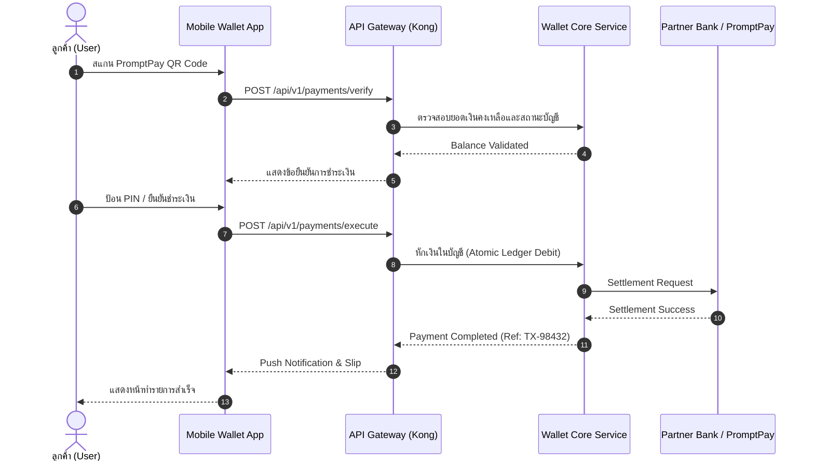

# 2. สถาปัตยกรรมทางเทคนิคและการเชื่อมต่อ (Technical Architecture)

ส่วนนี้อธิบายการทำงานเชิงระบบ การไหลของข้อมูลธุรกรรม (Transaction Flow) และการเชื่อมต่อระหว่าง Microservices

## 2.1 ลำดับการทำธุรกรรมชำระเงิน (Payment Flow Sequence)

แผนภาพแสดงขั้นตอนการชำระเงินแบบเรียลไทม์ระหว่าง Mobile App, API Gateway, Wallet Core Engine และ Payment Clearing House:



---

## 2.2 โครงสร้างข้อมูลธุรกรรม (Transaction API Payload)

ตัวอย่าง JSON Payload มาตรฐานสำหรับการทำรายการโอนเงินระหว่างกระเป๋า:

```json
{
  "transactionId": "TX-20260922-89210",
  "sourceWalletId": "WLT-TH-0812345678",
  "destinationWalletId": "WLT-TH-0898765432",
  "amount": 1500.00,
  "currency": "THB",
  "channel": "PROMPTPAY_QR",
  "metadata": {
    "terminalId": "POS-BKK-01",
    "fee": 0.00
  },
  "timestamp": "2026-09-22T15:30:00Z"
}
```

---

## 2.3 การลงนามยืนยันขอบเขตงาน (Sign-off & Acceptance)

เมื่อคู่สัญญาทั้งสองฝ่ายได้ตรวจสอบและเห็นพ้องกับรายละเอียดตามเอกสารนี้แล้ว ให้ลงนามไว้เป็นหลักฐาน:

| บทบาทหน้าที่ | ชื่อ-นามสกุล | ลายมือชื่อ | วันที่ |
| :--- | :--- | :--- | :--- |
| **Lead Solution Architect** | สมชาย สถาปัตย์มั่นคง | _____________________ | _____ / _____ / 2026 |
| **Product Owner** | นภา วิสัยทัศน์กว้าง | _____________________ | _____ / _____ / 2026 |
| **Client Project Director** | ธนา วาณิชย์ไพศาล | _____________________ | _____ / _____ / 2026 |
